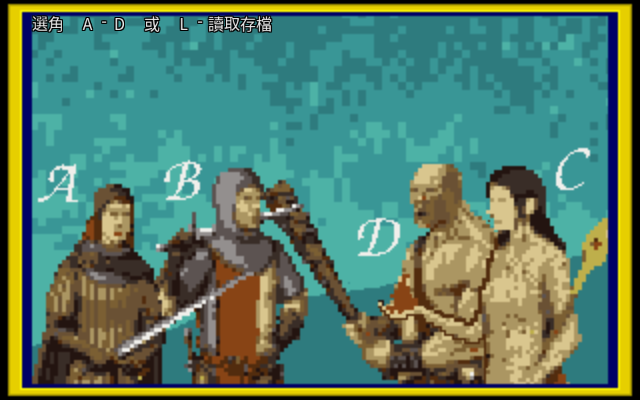
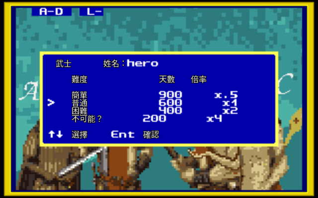
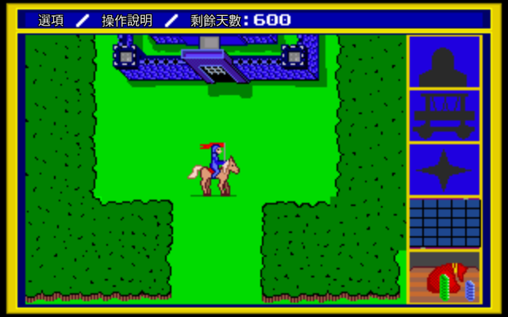
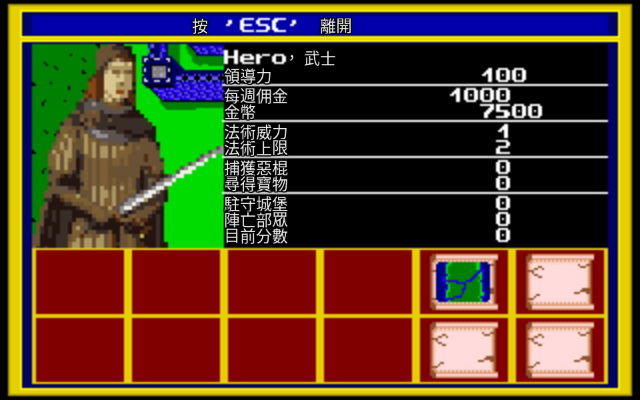
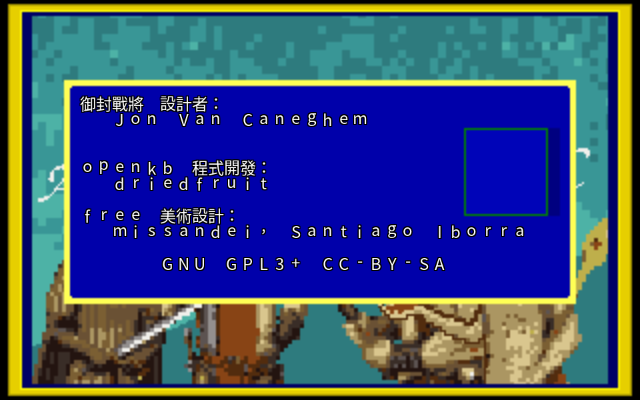
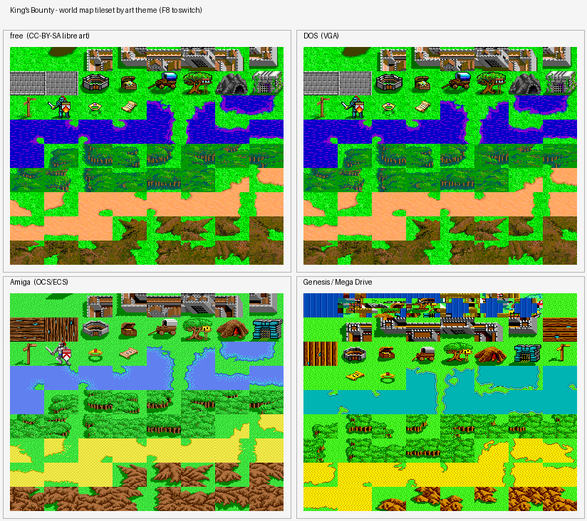
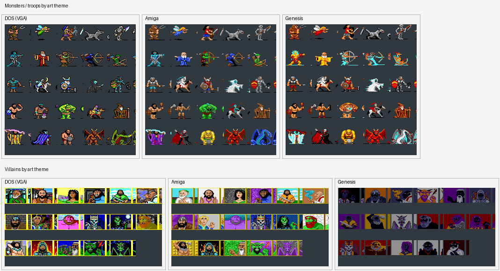

# 御封戰將 — King's Bounty 繁體中文版

還記得嗎?那是 1990 年代的某個深夜,14 吋 CRT 螢幕泛著微光,你守著一份從《電腦玩家》《軟體世界》上抄來的攻略,在 320×200 的世界裡帶著一支雜牌軍,翻山越嶺去追捕一個又一個逃犯。那個年代沒有 GameFAQ、沒有 Discord、沒有 wiki,只有三大誌的手冊翻譯,和 BBS 攻略板上你來我往的口耳相傳。

《King's Bounty》當年在臺灣有個很體面的官方譯名——《御封戰將》。可是真正摸到中文版的人沒幾個。多數人是抱著英文版、對著手冊上的中英對照表,一個字一個字猜過來的。三十年過去,我們把這份遲到的中文補上了:不是把中文「貼」在畫面旁邊,而是讓方塊字真真切切地畫進這款老遊戲的畫布裡。

這個 repo,就是那句「可惜當年沒玩到中文版」遲到三十年的回答。

---

上面講的是情懷,接下來講這到底是個什麼遊戲,以及我們做了些什麼。

## 實機畫面

方塊字真真切切畫進了這款 320×200 的老遊戲——製作名單、選角、開局設定、世界地圖、軍隊狀態,全是繁體中文。

| | |
|---|---|
|  |  |
| 選角:武士、遊俠、女巫師、蠻俠 | 開局設定:難度、天數、倍率 |
|  |  |
| 世界地圖:選項 / 操作說明 / 剩餘天數 | 角色狀態:領導力、金幣、法術威力… |



## 這是什麼遊戲

《御封戰將》是策略、角色扮演與探索的混血兒。國王交給你一紙懸賞令:四塊大陸被惡棍盤據,你要招募軍隊、追捕通緝犯、搜刮寶物,一塊一塊把疆土收復回來。

你會在地圖上招兵買馬——從廉價的農民、矮人,一路到要重金供養的龍與巨人;你會循著線索追捕散落各洲的惡棍 boss,每抓到一個就多一分國王的賞識;你會挖出沉睡的工藝品,讓自己的領導力、法力與行軍能力更上一層。地圖很大,時間有限,軍隊要錢養,什麼時候該擴張、什麼時候該回城補給,全是你的取捨。這就是當年讓無數玩家熬夜到天亮的那股魔力。

開局先選一個職業,四種各有脾性:

| 職業 | 原文 | 特色取向 |
|---|---|---|
| 武士 | Knight | 領導力強,適合帶大軍硬碰硬 |
| 遊俠 | Paladin | 攻守均衡的全才 |
| 女巫師 | Sorceress | 法力見長,靠法術扭轉戰局 |
| 蠻俠 | Barbarian | 行動力與兵力俱佳,衝勁十足 |

選哪個職業,等於決定你這趟征途要靠刀劍、靠法術,還是靠一支壓垮對手的大軍。職業名、兵種、法術、寶物的譯名,全部照 1990 年代官方手冊走,不是我們自己掰的——這點待會在技術區會再交代清楚。

老玩家可能會問:那我要去哪裡弄原版的遊戲資料?好消息是不必。openkb 引擎附帶一套叫 `free` 的自由美術與資料模組,所有兵種、城鎮、法術、劇情文字都是人類可讀的純文字,搭配開放授權的美術。換句話說,你**不需要自備原版遊戲**就能直接玩到一款完整、且中文化的《御封戰將》。

那中文化到底動了什麼?簡單說兩件事。一是把 `free` 模組裡的所有資料文字翻成繁體中文——兵種、城鎮、城堡、法術、寶物描述、惡棍通緝令、片頭與結局。二是把寫死在程式裡的英文 UI 標籤與訊息也一併翻掉——狀態面板上的「領導力」「金幣」「法術威力」,地圖頂上的操作提示,通通變成中文。最關鍵、也最費工的,是讓中文能在這款 320×200 的老遊戲裡正常顯示:這需要替引擎重寫一條文字渲染管線,細節留給下一段。

---

以下是給想自己建置、或想了解內部如何運作的人看的技術說明。

## 建置與遊玩

全程在 Docker 內建置,不污染系統環境。

建置字型 atlas(用 Noto Sans CJK TC 烘烤點陣字):

```sh
docker run --rm -v "$PWD":/src -w /src \
  ghcr.io/astral-sh/uv:python3.12-bookworm-slim bash docker/build-font.sh
```

建置遊戲本體(SDL2 環境):

```sh
docker build -t openkb-build-sdl2 -f docker/Dockerfile.sdl2 .
docker run --rm -v "$PWD":/src -w /src openkb-build-sdl2 sh docker/build.sh
```

啟動時需顯式指定 `free` 模組(引擎對 free 模組的自動偵測未實作):於設定中指定 `[module] type=free path=<絕對路徑>/data/free/`。模組選單即使只有單一模組仍需按 Enter 進入。

打包後的 AppImage 可直接在 Linux 上執行,免安裝。

## 換成原版 DOS 美術 (選用)

GitHub Releases 提供的是 **free 美術版**(可自由散布,免原版即可玩)。如果你**擁有原版 King's Bounty 的 DOS 遊戲檔**,只要多放三個檔,畫面就會換成經典的原版 VGA 美術 —— 而文字仍維持繁體中文。沒放這些檔時,一切照舊用 free 美術。

### 你需要的檔案

從你的原版 King's Bounty (DOS) 取出這三個檔:

- `256.CC` (VGA 美術)
- `416.CC` (美術/資料)
- `KB.EXE` (遊戲資料)

### 放在哪裡 (擇一)

**方法 A — 環境變數 (AppImage 最方便):** 指向放著上述三檔的資料夾即可。

```sh
KB_ORIGINAL_DOS=/path/to/your/kings-bounty  ./KingsBounty-CHT-x86_64.AppImage
```

**方法 B — 放在執行目錄旁:** 在你執行遊戲的目錄下開一個 `kings-bounty/` (或 `dos/`) 子資料夾,把三個檔放進去:

```
你執行遊戲的資料夾/
├── KingsBounty-CHT-x86_64.AppImage
└── kings-bounty/
    ├── 256.CC
    ├── 416.CC
    └── KB.EXE
```

**方法 C — 從原始碼建置:** 把三個檔放進 `data/` 目錄即可。

啟動時若偵測到 `256.CC`,日誌會出現 `Original DOS data found ... using original artwork.`,畫面即為原版美術 + 中文。偵測順序:`KB_ORIGINAL_DOS` → 資料目錄 → 安裝目錄 → `dos/` → `kings-bounty/` → 目前目錄。

### 運作原理

採型別感知資源解析:**圖形**優先取原版 DOS 資料,**文字 / 數值**優先取我們翻譯的 free 資料。所以你得到原版畫面,但選單、兵種、法術、劇情全是繁體中文。

> 原版遊戲資料受版權保護,**不包含在本專案、也不在 Releases 內**;請勿散布任何內含原版美術的打包。此功能僅供已擁有正版者本機使用。

## CJK 渲染原理

引擎原本的文字路徑是純 ASCII 的 8×8 點陣字格,沒有任何多位元組處理,中文無從畫起。本專案沿用《銀河霸主》(1oom) 中文化驗證過的作法,核心是**邏輯座標不動,只在合成層放大**:

- 遊戲的邏輯畫布全程維持原始 320×200。所有 UI 元件位置與滑鼠命中判定都不重新映射,省去了重排整套介面的工程量。
- 偵測到畫面含中文時,底圖以最近鄰(nearest)整數放大到 640×400 合成層,中文字以點陣 glyph(atlas 烘為 24×24,繪製時依面板行高縮放,密集面板約 16px 以對齊 8px 行距)疊上,周圍加八方位黑色外框、低亮度自動提亮,確保在彩色背景上仍清晰可讀。
- 文字繪製函式加入 UTF-8 解碼,逐字分流:命中字型 atlas 的漢字走 CJK 繪製清單,其餘走原本的 ASCII 路徑。
- 字型不依賴使用者機器既有字型,而是把 Noto Sans CJK TC 預先烘烤成隨包綁定的點陣 atlas(`data/cjk24.bin`)。

完整的技術決策與取捨記錄於 [`docs/adr/0001-engine-and-cjk-approach.md`](docs/adr/0001-engine-and-cjk-approach.md),逐階段的工程計畫見 [`PLAN.md`](PLAN.md)。

## 多版本美術與逆向工程

按 F8 可在四套美術主題間切換:`free`、原版 DOS、Genesis、Amiga。文字維持繁體中文不變,只換底圖與調色盤。



上圖為同一組世界地圖 tile（72 格）在四套主題下的解碼結果,用於說明本專案的跨平台美術解碼與 F8 切換成果。其中 `free` 為 CC-BY-SA 自由美術;DOS、Amiga、Genesis 三套由各原版的資料檔即時解碼而成,僅作技術對照與保存／在地化研究用途(轉化性使用),原版美術版權仍屬原權利人,本專案不散布原版資料本身。



怪物（兵種）與反派頭像的跨主題對照(DOS／Amiga／Genesis;`free` 的怪物美術僅含少數,其餘沿用 DOS,故不另列)。Genesis 的 sprite 調色盤在 ROM 內為壓縮資料,本專案以 Genesis 模擬器的 CRAM 內容作為色彩基準還原,讓原本全黑的剪影正確上色。版權同上。

Amiga 美術存放在自帶的容器格式裡:檔頭含子圖數、描述子、32 色 palette、壓縮與解壓尺寸,接著是壓縮資料流。壓縮採 Okumura LZSS,與 Genesis 版同源(`length = (b2 & 0xF) + 3`);像素排列為 sequential planar(5 個 bitplane,plane0 為 LSB,byte 內 MSB-first)。palette 是 12-bit 0RGB,每個 4-bit 通道展開成 8-bit 時用 `nibble << 4`(對應 Amiga OCS/ECS 硬體行為),不是 `× 17`。

Amiga 主題初期配色全錯,根因是 palette off-by-one:真實 palette 從描述子之後的「第一個」word 開始(count=1 時 offset 10),舊碼多跳了一個 word,使每個 pixel index 都顯示成 `palette[i-1]` 的色——天空變 teal、亮綠草地變中綠、sprite 的 index 0 變白而非透明。定位方法是反推:正確對齊時每個 index 應對應參考截圖中的單一顏色(色散最小),由此一眼看出 `index i → palette[i-1]` 的位移規律,比盲試 plane 排列快得多;比對「palette 色集」會被 index 重排隱藏,所以驗證配色必須逐像素比對渲染結果。以真實 Amiga「Plains」截圖為基準,逐像素均差從 213.8 降到 4.8(commit `03ffd6f` / `3cd74fd`)。另修正地圖英雄的黑色方框:`GR_HERO` 與 `GR_CURSOR` 是同一資源,Amiga 載入時漏設 transparent,index 0 未轉成 colorkey,補上後 index 0 透明、可見草地(commit `d9d9617`)。

目前 F8 四主題中,`free`、DOS、Amiga 的配色與透明皆正確;Genesis 主題的世界地圖 tileset 尚未完全破解,切換到 Genesis 時地圖仍有破碎、藍色直條紋的 tile(troop sprite 顯示正常),屬已知待辦。

完整的逆向細節(容器格式、LZSS 參數、planar 解碼、驗證表)見 [`docs/reverse-engineering/amiga-assets.md`](docs/reverse-engineering/amiga-assets.md)。

## 譯名來源

法術、兵種、寶物、職業與遊戲標題,一律採用 1990 年代官方繁體中文手冊的譯名。當年的手冊以「中文(English)」並列的方式給出這些名稱,我們照單沿用,不另創術語。

至於惡棍(villain)、城鎮、城堡與大陸名,官方手冊並未逐一收錄譯名。考據後確認手冊確實沒有這些專名的對照,因此採一致風格自行音譯。這是時代條件使然——當年的手冊本就沒譯到這一層,而非我們略過。開發用的作弊選單則保留英文。

## 目標平台與目前狀態

| 平台 | 狀態 |
|---|---|
| Linux AppImage | 可建置 |
| Windows | 規劃中(mingw 交叉編譯) |
| macOS | 規劃中(CI 打包) |
| Android | 規劃中(SDL2 NDK + 觸控介面) |

目前遊戲可正常啟動、建立角色、進入世界地圖並操作,已測畫面的中文全部正確渲染、無亂碼、無垂直重疊。戰鬥、城鎮內部、商店等需要精確走位才能觸發的畫面,因 headless 自動化限制尚待人工實機補測。詳細的測試方法、各畫面驗證結果與已知取捨,見 [`docs/test/GAME-TEST-REPORT.md`](docs/test/GAME-TEST-REPORT.md)。

## 授權

- **引擎程式碼**:GNU GPL v3 或更新版本(承襲 openkb,見 [`src/COPYING`](src/COPYING))。
- **`free` 模組自由資產**:CC-BY-SA 4.0 與 GPL v3 雙重授權(承襲 openkb)。
- **中文字型**:Noto Sans CJK TC,SIL Open Font License。
- 原版遊戲資料(`*.CC`、`KB.EXE`)與官方手冊 PDF 受版權保護,**不包含在本 repo**;玩家如需以原版資料遊玩,請自備合法副本。官方繁中手冊僅作為本專案的譯名對照來源,其譯名版權屬原代理。

## 致謝

完整貢獻記錄見 [`CONTRIBUTORS.md`](CONTRIBUTORS.md)。簡列各方:

- **原作**:Jon Van Caneghem 設計,New World Computing 發行(King's Bounty, 1990)。
- **官方繁中譯本**:1990 年代於臺灣以「御封戰將」之名引進、留下官方手冊的代理與當年的譯者——本專案的譯名權威來源。
- **openkb 開源引擎**:Vitaly Driedfruit 及貢獻者(SourceForge `p/openkb/code`)。本專案為其 fork。
- **`free` 模組自由美術**:missandei、Santiago Iborra。
- **中文字型**:Noto Sans CJK TC(Google / SIL OFL)。
- **本中文化專案**(2026):SDL2 移植、CJK 點陣渲染管線、全文翻譯與跨平台打包;以 Claude Code (Opus 4.8) 協作完成。GitHub: [wicanr2/open-king-bounty-cht](https://github.com/wicanr2/open-king-bounty-cht)。
